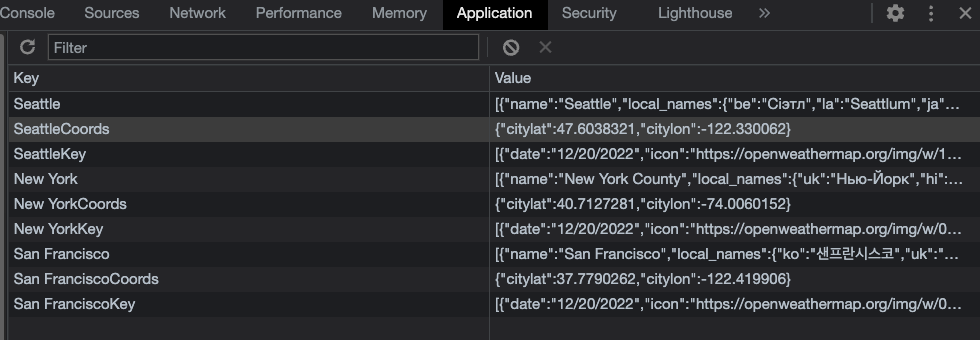

# weatherDashboard

(https://github.com/kji00/weatherDashboard)

(https://kji00.github.io/weatherDashboard/)

The purpose of this web application is to get weather information from various locations and present it to the user. When a user searches for a city, the user gets prompted with multiple cities to choose from (to get the exact city the user wants). After the city is chosen, the exact cooredinates are taken and requested from the openweathermap API. 5 Day forecasts are disaplyed and stored to local storage to keep a track of cities searched.

User story

AS A traveler
I WANT to see the weather outlook for multiple cities
SO THAT I can plan a trip accordingly

GIVEN a weather dashboard with form inputs

WHEN I search for a city
THEN I am presented with current and future conditions for that city and that city is added to the search history

WHEN I view current weather conditions for that city
THEN I am presented with the city name, the date, an icon representation of weather conditions, the temperature, the humidity, and the the wind speed

WHEN I view future weather conditions for that city
THEN I am presented with a 5-day forecast that displays the date, an icon representation of weather conditions, the temperature, the wind speed, and the humidity

WHEN I click on a city in the search history
THEN I am again presented with current and future conditions for that city